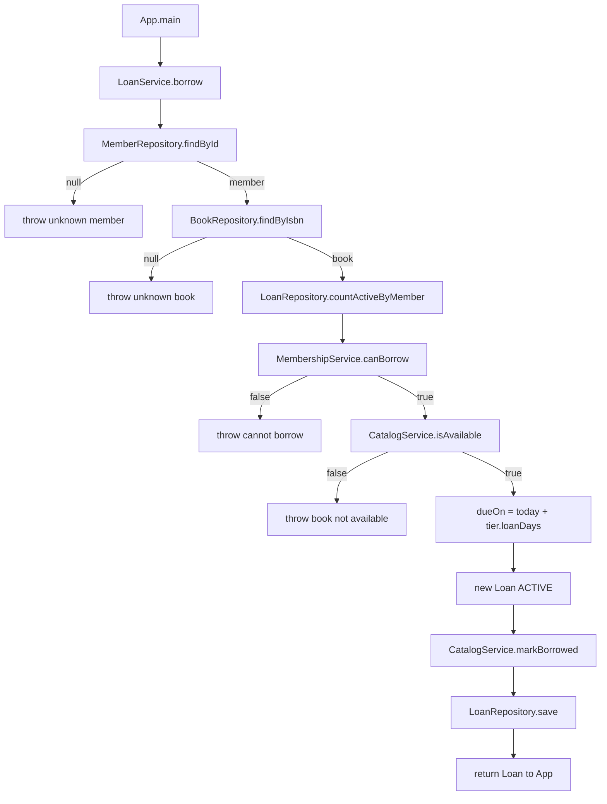
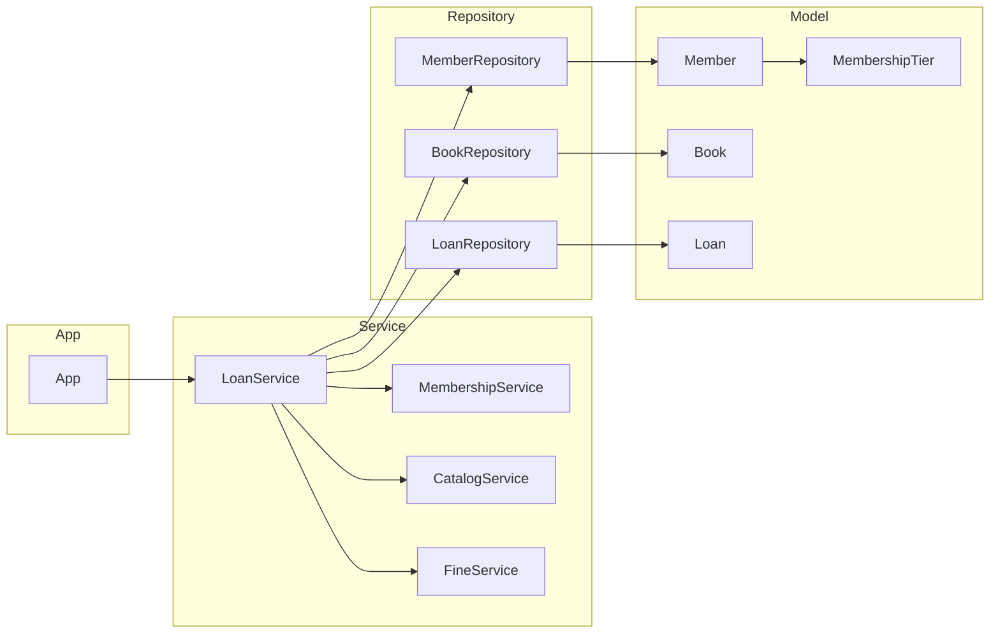

# Assignment 2: AI-Assisted Codebase Investigation

**Student:** Ishant Bisen  
**Date:** 22 September 2026  
**Project:** `library-lending-app` (local only — this assignment does **not** use GitHub)  
**Primary AI tool:** Antigravity CLI (`agy`)  
**MCP server:** Filesystem MCP, scoped to `/Users/ishant.bisen/Downloads/library-lending-app`

This app is **not broken**. The work is to understand an unfamiliar service through AI + Filesystem MCP, not to patch a crash.

---

## Setup (what I did)

1. Unzipped `library-lending-app.zip` to `/Users/ishant.bisen/Downloads/library-lending-app`.
2. Confirmed JDK 21 and Maven 3.9.10.
3. Connected Filesystem MCP to **that folder only**:

```bash
agy mcp add filesystem npx -y @modelcontextprotocol/server-filesystem /Users/ishant.bisen/Downloads/library-lending-app
agy mcp list
cd /Users/ishant.bisen/Downloads/library-lending-app
agy
```

4. Verified before investigating: asked the AI (via Filesystem MCP) to list `src/` and read `pom.xml`. It returned the real tree and `exec.mainClass` = `com.rsl.library.App`. It could not see files outside that folder.
5. Optional run (README): `mvn test` then `mvn -q compile exec:java`. **6 tests passed.** The console showed a borrow, a late return (50c), an on-time return (0c), and a refused lapsed member. That confirmed what the code was for; it did not replace tracing the borrow path.

I did **not** read every file top to bottom first. I asked the AI to locate borrowing, then only opened the files it named.

---

## Task 1 — Locate the feature

**The feature** is *borrowing a book*: a member takes a catalogued copy off the shelf, the library records a loan with a due date, and that copy becomes unavailable until it is returned.

**Entry-point class:** `com.rsl.library.service.LoanService`  
**Entry-point method:** `borrow(String memberId, String isbn, LocalDate today)`

`App.main` is only a demo driver. It calls `lending.borrow(...)`. The method that actually implements the feature is `LoanService.borrow`.

How this was found without reading the whole tree: asked the Filesystem MCP to search for `borrow` under `src/`. Hits were `App.java` (caller) and `LoanService.java` (definition). `pom.xml` named `App` as `exec.mainClass`, so the demo starts there and immediately delegates.

---

## Task 2 — Related classes and responsibilities

These are the classes on the borrow path. Each line is what that class is **for**, not a copy of its source.

### Models

| Class | File | Responsibility |
|---|---|---|
| `Book` | `src/main/java/com/rsl/library/model/Book.java` | One physical copy: ISBN, title, author, and whether it is on the shelf (`available`). |
| `Member` | `src/main/java/com/rsl/library/model/Member.java` | Who is borrowing: id, name, `MembershipTier`, and whether the membership is still active. |
| `MembershipTier` | `src/main/java/com/rsl/library/model/MembershipTier.java` | Rules for STANDARD vs PREMIUM: max books out at once, and loan length in days. |
| `Loan` | `src/main/java/com/rsl/library/model/Loan.java` | The record of a borrow: book ISBN, member id, borrowed-on, due-on, status (`ACTIVE` until returned). |
| `LoanStatus` | `src/main/java/com/rsl/library/model/LoanStatus.java` | `ACTIVE` or `RETURNED`. |

### Repositories (in-memory stores)

| Class | File | Responsibility |
|---|---|---|
| `MemberRepository` | `src/main/java/com/rsl/library/repository/MemberRepository.java` | Look up a member by id. Returns `null` if unknown. |
| `BookRepository` | `src/main/java/com/rsl/library/repository/BookRepository.java` | Look up a book by ISBN. Returns `null` if unknown. |
| `LoanRepository` | `src/main/java/com/rsl/library/repository/LoanRepository.java` | Save loans, find by id, and **count ACTIVE loans for a member** (used for the concurrent-loan limit). |

### Services

| Class | File | Responsibility |
|---|---|---|
| `LoanService` | `src/main/java/com/rsl/library/service/LoanService.java` | **Coordinator.** `borrow` and `returnBook`. This is the feature entry point. |
| `MembershipService` | `src/main/java/com/rsl/library/service/MembershipService.java` | May this member take one more book? Must be active **and** under their tier’s max concurrent loans. |
| `CatalogService` | `src/main/java/com/rsl/library/service/CatalogService.java` | Is a copy on the shelf? Flip `available` when borrowed or returned. |
| `FineService` | `src/main/java/com/rsl/library/service/FineService.java` | Late fines on **return**, not on borrow. Not on the borrow call path. |

### App / logging

| Class | File | Responsibility |
|---|---|---|
| `App` | `src/main/java/com/rsl/library/App.java` | Wires repositories and services, seeds three books and three members, runs four demo scenarios. |
| `AppLogger` | `src/main/java/com/rsl/library/util/AppLogger.java` | Console + `logs/app.log`. |

`FineService` is a sibling of borrowing, not a step inside `borrow`. I include it so the layer picture is complete; the borrow flow does not call it.

---

## Task 3 — Execution flow (entry point → saved loan)

Call path in order, with the checks that actually matter.

1. **`App.main`**  
   Example: `lending.borrow("M-1", "978-0132350884", LocalDate.of(2026, 8, 1))`.

2. **`LoanService.borrow`**  
   Starts the feature.

3. **`MemberRepository.findById(memberId)`**  
   If `null` → `IllegalArgumentException("Unknown member: …")`. Stop.

4. **`BookRepository.findByIsbn(isbn)`**  
   If `null` → `IllegalArgumentException("Unknown book: …")`. Stop.

5. **`LoanRepository.countActiveByMember(memberId)`**  
   How many books they already have out (`LoanStatus.ACTIVE` only).

6. **`MembershipService.canBorrow(member, activeCount)`**  
   - Inactive / lapsed membership → false.  
   - `activeCount >= tier.getMaxConcurrentLoans()` → false.  
     STANDARD max = **3**, PREMIUM max = **10**.  
   If false → `IllegalStateException` (“cannot borrow (inactive, or at their loan limit)”). Stop.  
   Carol in the demo fails here (`active = false`). The catalog is never touched.

7. **`CatalogService.isAvailable(book)`**  
   Reads `book.isAvailable()`. If false → `IllegalStateException("Book is not available: …")`. Stop.

8. **Due date**  
   `today.plusDays(member.getTier().getLoanDays())`.  
   STANDARD = **14** days, PREMIUM = **28** days.  
   Alice on 1 Aug is due **15 Aug**.

9. **`new Loan(nextLoanId(), isbn, memberId, today, dueOn)`**  
   Status starts as `ACTIVE`. Ids are `L-1`, `L-2`, …

10. **`CatalogService.markBorrowed(book)`**  
    `available = false`. The copy is off the shelf.

11. **`LoanRepository.save(loan)`**  
    The loan is stored in the in-memory map. **This is the end of the borrow feature.**

12. Log line + return the `Loan` to `App`.

Nothing after `save` is required to complete a borrow. Returning the book is a separate method (`returnBook`), which then uses `FineService`.

---

## Task 4 — Architecture summary and diagram

**Layers**

```text
App
  constructs and calls
    LoanService          ← application / domain service (use-case)
      uses
        MembershipService, CatalogService, FineService   ← supporting services
        MemberRepository, BookRepository, LoanRepository ← persistence (in-memory)
          store
            Member, Book, Loan, MembershipTier, LoanStatus  ← model
```

**How they depend**

- **App** depends on services and repositories (it wires them). It does not contain borrow rules.
- **LoanService** depends on the three repositories and the three services. It owns the use-case order.
- **MembershipService** and **CatalogService** depend only on **model** types. They do not talk to repositories.
- **Repositories** depend only on **model**. They do not call services.
- **Model** depends on nothing else in the project.

**Where responsibilities live**

- Concurrent-loan limit and “must be active” → `MembershipService` + `MembershipTier`.
- On-shelf vs on-loan → `CatalogService` + `Book.available`.
- Due date → `LoanService.borrow` using `MembershipTier.getLoanDays()`.
- Persisting the loan → `LoanRepository.save`.
- Late money → `FineService` on return, not on borrow.

**Borrow-book flow**



**Major layers**



`FineService` is on the service layer for returns; it is unused during `borrow`.

---

## Optional run — what we saw (not a bug hunt)

```text
mvn test
Tests run: 6, Failures: 0, Errors: 0, Skipped: 0

mvn -q compile exec:java
Borrowed: Loan{L-1, 978-0132350884, member=M-1, due=2026-08-15, ACTIVE}
Returned late, fine = 50c
Returned on time, fine = 0c
Refused as expected: Carol cannot borrow (inactive, or at their loan limit)
```

That matches the flow above: Alice STANDARD + 14 days; Carol fails at `canBorrow` before save.

---

## How AI + Filesystem MCP changed the investigation

I did not open every class in order. I asked the Filesystem MCP to search for `borrow`, then only read `LoanService` and the types it calls. That is closer to joining a real service: start at the use-case, then walk collaborators. GitHub MCP would have been the wrong tool here — there is no remote repo, and `logs/app.log` is local and gitignored. The MCP scoped to one folder also stopped the investigation from wandering into other Downloads projects.

---

## AI transcript (investigation evidence)

**Prompt:** Using Filesystem MCP, list `src/main/java/com/rsl/library` and find where borrowing a book is handled. Name the class and method. Do not dump every file.

**AI:** Feature lives in `LoanService.borrow`. `App.main` only calls it.

**Prompt:** List every class involved in that method and one sentence each on responsibility.

**AI:** Returned the model / repository / service split in Task 2 (member lookup, book lookup, active-loan count, `canBorrow`, `isAvailable`, `markBorrowed`, `save`).

**Prompt:** Walk the call path from `App` to `LoanRepository.save` in order, including the throws.

**AI:** The sequence in Task 3, including inactive Carol stopping before catalog changes.

**Prompt:** Draw the layers and a borrow flowchart. Say where due dates and loan limits live.

**AI:** Due dates and limits live on `MembershipTier`; `LoanService` applies them; repositories only store.

---

## Checklist against the brief

| Brief item | Status |
|---|---|
| Unzip locally, no GitHub | Done |
| Optional `mvn test` / `exec:java` | Done — 6/6, four scenarios as designed |
| Filesystem MCP scoped to this folder | Done |
| Verify list/read before starting | Done |
| Task 1 entry-point class + method | `LoanService.borrow` |
| Task 2 related classes + responsibilities | Table above |
| Task 3 flow to saved loan | 12-step path |
| Task 4 layers + Mermaid diagrams | Two diagrams |
| Own words + how MCP changed the work | Section above |
